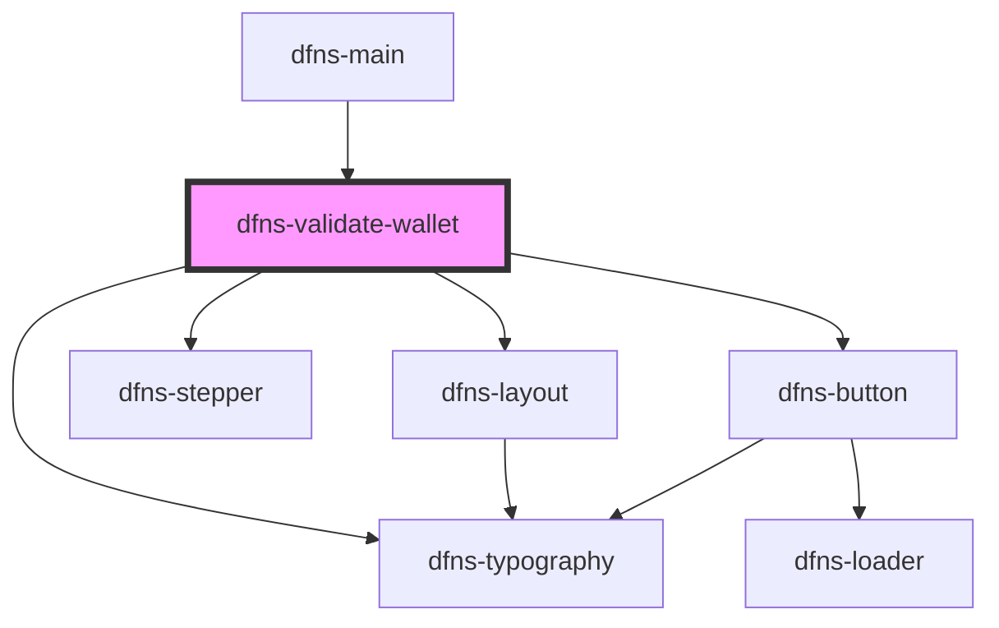

# dfns-create-account

<!-- Auto Generated Below -->

## Events

| Event           | Description | Type                                                                                                                                                                                                                                                                                                                                                                                                                                                                                                                                                                                                                                                                                                                                                                                                                                                                                                 |
| --------------- | ----------- | ---------------------------------------------------------------------------------------------------------------------------------------------------------------------------------------------------------------------------------------------------------------------------------------------------------------------------------------------------------------------------------------------------------------------------------------------------------------------------------------------------------------------------------------------------------------------------------------------------------------------------------------------------------------------------------------------------------------------------------------------------------------------------------------------------------------------------------------------------------------------------------------------------- |
| `walletCreated` |             | `CustomEvent<{ id: string; network: "ArbitrumOne" \| "ArbitrumGoerli" \| "ArbitrumSepolia" \| "AvalancheC" \| "AvalancheCFuji" \| "Base" \| "BaseGoerli" \| "BaseSepolia" \| "Bitcoin" \| "BitcoinTestnet3" \| "Bsc" \| "BscTestnet" \| "Ethereum" \| "EthereumGoerli" \| "EthereumSepolia" \| "FantomOpera" \| "FantomTestnet" \| "Optimism" \| "OptimismGoerli" \| "OptimismSepolia" \| "Polygon" \| "PolygonMumbai" \| "Ripple" \| "RippleTestnet" \| "Solana" \| "SolanaDevnet" \| "Tezos" \| "TezosGhostnet" \| "Tron" \| "TronNile" \| "KeyECDSA" \| "KeyECDSAStark" \| "KeyEdDSA"; address?: string; signingKey: { scheme: "ECDSA" \| "EdDSA"; curve: "ed25519" \| "secp256k1" \| "stark"; publicKey: string; }; status: "Active" \| "Archived"; dateCreated: string; name?: string; imported?: boolean; exported?: boolean; dateExported?: string; externalId?: string; tags?: string[]; }>` |

## Dependencies

### Used by

 - [dfns-main](../dfns-main)

### Depends on

- [dfns-layout](../../Materials/Templates/dfns-layout)
- [dfns-typography](../../Elements/Typography/dfns-typography)
- [dfns-stepper](../../Elements/Stepper/dfns-stepper)
- [dfns-button](../../Elements/Buttons/dfns-button)

### Graph

----------------------------------------------

*Built with [StencilJS](https://stenciljs.com/)*
